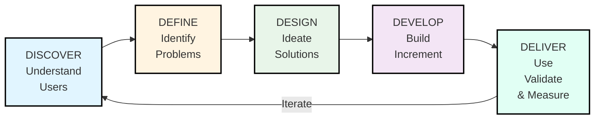

# HCD Agile Process Phases

## Overview

The HCD Agile process follows a cyclical pattern that combines the depth of Human-Centered Design with the speed of Agile development. Unlike traditional waterfall or pure Agile approaches, HCD Agile emphasizes continuous learning and validation throughout the development lifecycle.

## The Five Main Phases

---

## Phase 1: Discover

### Objective

Deeply understand users, their needs, pain points, and the context in which they operate.

### Key Activities

#### 1. Stakeholder Alignment

- Define project goals and success metrics
- Identify key stakeholders and users
- Establish constraints and requirements
- Align on vision and scope

#### 2. User Research

- **Interviews**: One-on-one conversations with users
- **Contextual Inquiry**: Observing users in their environment
- **Surveys**: Gathering quantitative data
- **Analytics Review**: Understanding current behavior patterns
- **Competitive Analysis**: Learning from similar solutions

#### 3. Continuous Discovery

- Rolling research program
- Hypothesis generation
- Assumption mapping
- Ongoing market scanning

### Deliverables

- Research report with key insights
- User personas (2-4 primary personas)
- Current state journey maps
- Raw data repository

### Duration

- Initial discovery: 1-2 weeks
- Ongoing research: 10-20% of each sprint

### Team Involvement

- **Lead**: UX Researcher, Product Owner
- **Support**: Entire team observes research sessions
- **Outcome**: Shared understanding of users and context

---

## Phase 2: Define

### Objective

Synthesize research insights and define clear problem statements that will guide solution development.

### Key Activities

#### 1. Synthesis & Sensemaking

- Review all Discovery phase research
- Identify patterns and themes
- Create affinity diagrams
- Distill key insights
- Validate findings with stakeholders

#### 2. Problem Framing

- Write problem statements
- Create "How Might We" (HMW) questions
- Frame challenges as opportunities
- Define problem scope and boundaries
- Validate problem statements with users

#### 3. Prioritization

- Evaluate opportunity areas
- Assess impact vs. effort
- Align with business objectives
- Get stakeholder buy-in
- Create prioritized roadmap

#### 4. Success Definition

- Define success metrics
- Identify key performance indicators (KPIs)
- Establish baseline measurements
- Set goals and targets
- Create measurement plan

### Deliverables

- Problem Statement(s)
- How Might We Questions
- Design Principles
- Success Metrics and KPIs
- Prioritized Opportunities
- Project Brief

### Duration

- 1-2 sprints typically
- Revisit as needed when new insights emerge

### Team Involvement

- **Lead**: Product Owner, UX Lead
- **Support**: Stakeholders, Tech Lead
- **Outcome**: Clear direction and prioritized problems to solve

---

## Phase 3: Design

### Objective

Generate, prototype, and validate solutions that address identified user needs.

### Key Activities

#### 1. Ideation

- Brainstorming sessions with diverse perspectives
- Design studios for collaborative sketching
- Exploring multiple solution directions
- Divergent thinking exercises
- Building on user insights

#### 2. Concept Development

- Sketching low-fidelity concepts
- Creating user flows
- Mapping interactions
- Defining information architecture
- Exploring multiple alternatives

#### 3. Prototyping

- **Low-Fidelity**: Paper prototypes, sketches
- **Medium-Fidelity**: Wireframes, clickable prototypes
- **High-Fidelity**: Interactive mockups with realistic content
- Progressive refinement based on feedback

#### 4. Early Validation

- Guerrilla testing with quick prototypes
- Concept testing with target users
- A/B testing different approaches
- Gathering qualitative feedback
- Iterating rapidly

#### 5. Design Refinement

- Incorporating feedback
- Creating design specifications
- Building component libraries
- Ensuring accessibility standards
- Documenting design decisions

### Deliverables

- Multiple concept options
- Validated prototypes
- User flows and wireframes
- Design specifications
- Interaction patterns
- Visual designs
- Component library (if needed)
- User testing results

### Duration

- Design sprint: 1-2 weeks
- Ongoing design: Running parallel with development

### Team Involvement

- **Lead**: UX/UI Designers
- **Support**: Product Owner, Developers (technical feasibility)
- **Validation**: Users (testing), Entire team (feedback)

---

## Phase 4: Develop

### Objective

Build working software incrementally while maintaining focus on user needs and quality.

### Key Activities

#### 1. Sprint Planning

- Selecting validated designs for implementation
- Breaking down into technical tasks
- Estimating effort and complexity
- Planning validation activities
- Setting sprint goals

#### 2. Development

- Writing clean, maintainable code
- Following coding standards
- Implementing responsive designs
- Building accessibility features
- Creating automated tests

#### 3. Continuous Integration

- Code reviews with design context
- Automated testing (unit, integration, E2E)
- Design QA sessions
- Bug fixing and refinement
- Performance optimization

#### 4. In-Sprint Validation

- Quick usability checks on working features
- Developer testing with real scenarios
- Edge case validation
- Cross-browser/device testing
- Accessibility testing

#### 5. Collaboration

- Daily designer-developer sync
- Design reviews of implemented features
- Technical spikes for complex interactions
- Pair programming on UX-critical features
- Knowledge sharing sessions

### Deliverables

- Working software increment
- Automated test coverage
- Documentation (code, API, user)
- Bug and refinement backlog
- Deployment-ready release
- In-sprint validation results

### Duration

- Development sprint: 1-2 weeks
- Typically follows design by 1 sprint in dual-track

### Team Involvement

- **Lead**: Development Team
- **Support**: Designers (implementation guidance)
- **Quality**: QA, Accessibility specialists
- **Product Owner**: Acceptance and prioritization

---

## Phase 5: Deliver

### Objective

Launch the solution, monitor performance, gather feedback, and iterate based on real-world usage.

### Key Activities

#### 1. Pre-Deployment

- Final testing in staging environment
- Security and performance review
- Deployment plan creation
- Rollback plan preparation
- Communication plan to users and training materials

#### 2. Deployment

- Deploy to production environment
- Execute deployment plan and monitor process
- Validate deployment success
- Enable monitoring and alerts
- Communicate release to stakeholders

#### 3. Post-Deployment Monitoring

- Monitor system health
- Track success metrics and KPIs
- Gather user feedback and usage data
- Respond to incidents
- Analyze usage patterns

#### 4. Continuous Improvement

- Review metrics and feedback regularly
- Prioritize improvements
- Implement enhancements
- A/B test variations
- Address technical debt and optimize performance

### Deliverables

- Production release
- Deployment and rollback plans
- Release notes and user documentation
- Monitoring dashboard
- Incident response plan
- Iteration roadmap

### Duration

- Release: Varies (Continuous Deployment preferred)
- Monitoring: Ongoing
- Learning: Continuous feedback loop

### Team Involvement

- **Lead**: DevOps, Product Owner
- **Support**: Development Team, UX Researcher (feedback analysis)
- **Outcome**: Validated value in the hands of users

---

## Continuous Activities Across All Phases

### User Engagement

- Regular user testing sessions (weekly or bi-weekly)
- Continuous feedback collection
- User advisory board meetings
- Beta user community management

### Team Rituals

- Daily standups with user focus
- Sprint reviews with user insights
- Retrospectives with HCD lens
- Show-and-tells with stakeholders

### Documentation

- Decision logs (why we chose X)
- Research repository
- Design system maintenance
- Technical documentation

### Quality Assurance

- Automated testing
- Accessibility compliance
- Performance monitoring
- Security reviews

---

## Phase Transitions and Decision Gates

### Moving from Discover to Design

**Gate Criteria**:

- [ ] Clear user personas defined
- [ ] Key pain points identified and prioritized
- [ ] Problem statements articulated
- [ ] Success metrics defined
- [ ] Stakeholder alignment achieved

### Moving from Design to Develop

**Gate Criteria**:

- [ ] Design concepts validated with users
- [ ] Technical feasibility confirmed
- [ ] Design specifications complete
- [ ] Acceptance criteria defined
- [ ] Team understands the "why" behind design

### Moving from Develop to Deliver

**Gate Criteria**:

- [ ] All acceptance criteria met
- [ ] User validation completed (if possible pre-release)
- [ ] Quality standards satisfied
- [ ] Accessibility requirements met
- [ ] Deployment plan approved

### Re-entering Discover Phase

**Triggers**:

- Major user feedback or insight
- Significant change in user needs
- New user segment or market
- Strategic pivot or new opportunity
- Low adoption or satisfaction scores

---

## Adapting the Process

### For Small Projects

- Compress phases into shorter cycles
- Combine activities where appropriate
- Use lighter-weight methods
- Focus on core user validation

### For Large Enterprises

- Run multiple parallel streams
- Extend phases for complexity
- Add governance checkpoints
- Increase documentation rigor

### For Mature Products

- Emphasize Deliver phase learning
- Lighter discovery (incremental research)
- Focus on optimization and refinement
- Maintain design system

### For New Products (0 to 1)

- Extended Discover phase
- Multiple design iterations
- Phased development approach
- Careful measurement of adoption

---

## Success Indicators by Phase

### Discover Success

- High-quality user insights
- Team alignment on problems
- Clear prioritization rationale
- Validated opportunity areas

### Design Success

- Positive user testing results
- Technical feasibility confirmed
- Stakeholder approval
- Clear implementation path

### Develop Success

- High code quality
- Passing all tests
- Design fidelity maintained
- Performance targets met

### Deliver Success

- Smooth deployment
- Positive user feedback
- Metrics trending positively
- Low critical issues

---

*This document outlines the structured yet flexible approach to executing HCD Agile projects.*
