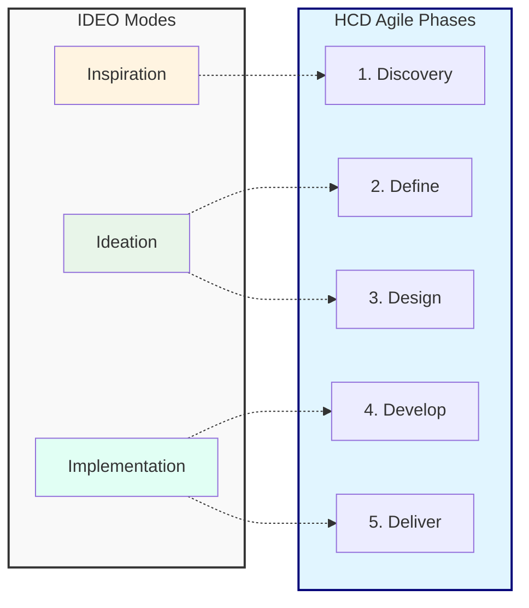

# Human-Centered Design Principles

## What is Human-Centered Design?

Human-Centered Design (HCD) is an approach to problem-solving that develops solutions by involving the human perspective in all steps of the problem-solving process. It's about building deep empathy with the people you're designing for, generating ideas, building prototypes, and putting your solutions in front of real users for feedback.

## The Three Phases of HCD

The IDEO model breaks HCD into three phases: **Inspiration**, **Ideation**, and **Implementation**. We map these to our 5-phase HCD Agile process below:

### 1. Inspiration (Maps to: [Discovery](process-phases#phase-1-discovery))

**Goal**: Understand the problem space and the people you're designing for.

**Activities**:

- **User Research**: Interviews, observations, ethnographic studies
- **Contextual Inquiry**: Watching users in their natural environment
- **Stakeholder Mapping**: Understanding all parties affected by the problem
- **Problem Definition**: Clearly articulating the challenge
- **Persona Development**: Creating representative user profiles
- **Journey Mapping**: Documenting current user experiences

**Outputs**:

- Research findings and insights
- User personas
- Journey maps
- Problem statements
- Opportunity areas

### 2. Ideation (Maps to: [Define](process-phases#phase-2-define) & [Design](process-phases#phase-3-design))

**Goal**: Generate a wide range of possible solutions.

**Activities**:

- **Brainstorming Sessions**: Generating many ideas without judgment
- **Design Studios**: Collaborative sketching and concept development
- **Prototyping**: Creating low-fidelity mockups and models
- **Concept Testing**: Getting early feedback on ideas
- **Iteration**: Refining concepts based on feedback

**Outputs**:

- Multiple solution concepts
- Low to medium fidelity prototypes
- Tested and refined designs
- Selected direction for development

### 3. Implementation (Maps to: [Develop](process-phases#phase-4-develop) & [Deliver](process-phases#phase-5-deliver))

**Goal**: Build the solution and validate it with real users.

**Activities**:

- **High-Fidelity Prototyping**: Creating realistic mockups
- **Usability Testing**: Observing users interacting with the product
- **A/B Testing**: Comparing different solutions
- **Beta Testing**: Releasing to a limited audience
- **Iteration**: Continuous improvement based on feedback

**Outputs**:

- Working product or service
- Validation data
- User feedback
- Metrics and KPIs
- Refinement priorities

## Key HCD Principles

### 1. Empathy is Essential

Build genuine understanding of users through:

- Direct observation
- In-depth interviews
- Immersion in their environment
- Walking in their shoes
- Listening without judgment

### 2. Involve Users Throughout

Don't just research at the beginning:

- Test concepts early and often
- Co-create with users when possible
- Get feedback at every stage
- Validate assumptions continuously
- Iterate based on real usage

### 3. Embrace Ambiguity

- Start with exploration, not solutions
- Be comfortable with uncertainty
- Challenge assumptions
- Stay curious and open-minded
- Let insights emerge from research

### 4. Think Holistically

Consider the entire user experience:

- Before, during, and after use
- All touchpoints and channels
- Emotional and practical needs
- Context and environment
- Broader ecosystem and stakeholders

### 5. Make it Tangible

Transform ideas into something users can experience:

- Create quick prototypes
- Use sketches and storyboards
- Build interactive mockups
- Make concepts concrete
- Test with real artifacts

### 6. Iterate, Iterate, Iterate

Continuous improvement through:

- Rapid prototyping
- Quick testing cycles
- Learning from failures
- Incremental refinement
- Building on insights

## HCD Tools and Techniques

### Research Methods

- User interviews
- Contextual observation
- Surveys and questionnaires
- Diary studies
- Focus groups
- Analytics analysis

### Synthesis Tools

- Affinity mapping
- Personas
- Journey maps
- Experience maps
- Empathy maps
- Service blueprints

### Ideation Techniques

- Brainstorming
- Design studios
- [Crazy 8s](https://web.archive.org/web/20231101000000*/https://designsprintkit.withgoogle.com/methodology/phase3-sketch/crazy-eights)
- [SCAMPER](https://web.archive.org/web/20231015000000*/https://www.interaction-design.org/literature/article/learn-how-to-use-the-best-ideation-methods-scamper)
- Mind mapping
- "How Might We" questions

### Prototyping Approaches

- Paper prototypes
- Wireframes
- Clickable prototypes
- [Wizard of Oz testing](https://web.archive.org/web/20231201000000*/https://www.nngroup.com/articles/wizard-of-oz/)
- Role-playing
- Video scenarios

### Validation Methods

- Usability testing
- A/B testing
- Concept testing
- Card sorting
- Tree testing
- Heuristic evaluation

## Measuring HCD Success

**User-Centric Metrics**:

- User satisfaction scores (CSAT, NPS)
- Task completion rates
- Time on task
- Error rates
- User engagement metrics
- Adoption and retention rates

**Business Metrics**:

- Reduced support costs
- Increased conversion rates
- Higher customer lifetime value
- Reduced development waste
- Faster time to market
- Improved ROI

## Common HCD Pitfalls to Avoid

1. **Assuming you know the users**: Always validate with research
2. **Designing for yourself**: Your preferences aren't universal
3. **Skipping the research phase**: Don't rush to solutions
4. **Testing too late**: Validate early and often
5. **Ignoring edge cases**: Consider all user scenarios
6. **Not involving stakeholders**: Keep everyone aligned
7. **Forgetting accessibility**: Design for all abilities

---

*Reference: Based on industry best practices in Human-Centered Design and design thinking methodologies.*
